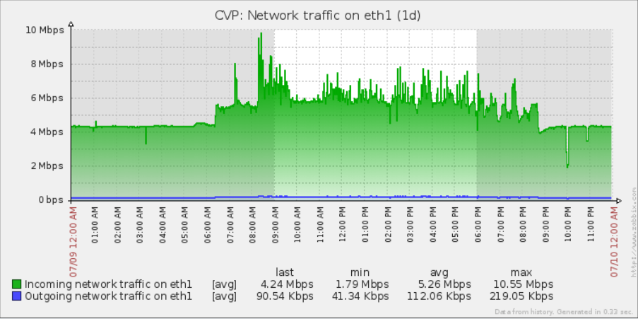
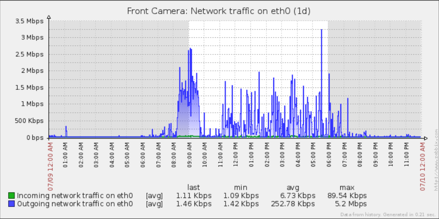
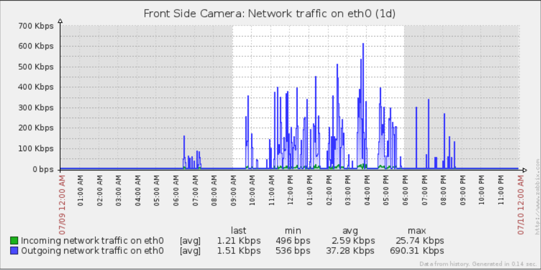

# Build Your Own Camera

[BYOC](https://github.com/sgjava/byoc/wiki) is an RK3066 based system that turns
an Android Google TV player into an intelligent camera system. You can of
course just use it as a wireless IP based webcam as well. Some of the advantages of
using a self contained intelligent camera system are: 
 
1. An attached USB camera is more reliable than most wifi cameras as it relates to
connectivity and FPS consistency.
2. A wider selection of camera resolutions and features for the money. You can
build a high definition camera (1280x720) for less than $100 US (I paid $77.71
with free shipping). You can also choose the USB camera that fits the application
at hand. Swap out the camera for a fraction of an IP based equivalent.
3. Resilience in terms of network connectivity which isn't required to capture
video. Once network services are restored the video files can be transferred
via email, SCP, etc. Most IP based cameras do not have storage hence you lose
the video stream during the outage. Your BYOC camera can last hours or days
without network connectivity!
4. Distributed processing saves you from having a system powerful enough to
capture all of your camera's video streams and process them. The camera can
run the same software as a full size system, so in essence you do not need
a central PC for processing video streams.
5. Being based on a popular Linux distribution allows for easy customization instead
of the crappy Chinese software on most cheap IP based cameras. You can even
load a GUI desktop for management if desired.

See the [Wiki](https://github.com/sgjava/byoc/wiki) for more information.

Here's an example of optimized network performance compared to always streaming cameras. The CVP server uses
a centralized model with four 640x480 MJPEG cameras that operate an average of about 15 FPS. During night (least amount of traffic)
time hours incoming traffic is just above 4 Mbps or about 1 Mbps per camera. This is because a centralized server is reading frames all
the time. The spikes you see are SCP activity from the BYOC cameras.

Now look at Front camera which is 1280x720 (3 times the resolution of 640 x 480) at 10 FPS. Note the outgoing traffic averages
252 Kbps. So that means about 1/4 the traffic and 3 times the resolution. This is possible since only compressed motion videos are
transfered over the network. By using the extra RK3066 core for compression your get about 10 times smaller files using XVID compared
to MJPEG. As better video compression is implemented expect smaller files.
 

Finally Front Side camera is using 1280x1024 at 5 FPS. It averages only 37 Kbps for the same 24 hour period. If you only sent files that
had just people detected it would use a lot less bandwidth. It really depends on the conditions and features you have enabled in CVP.

### FreeBSD License

Copyright (c) Steven P. Goldsmith

All rights reserved.

Redistribution and use in source and binary forms, with or without modification, are permitted provided that the following conditions are met:
* Redistributions of source code must retain the above copyright notice, this list of conditions and the following disclaimer.
* Redistributions in binary form must reproduce the above copyright notice, this list of conditions and the following disclaimer in the documentation and/or other materials provided with the distribution.

THIS SOFTWARE IS PROVIDED BY THE COPYRIGHT HOLDERS AND CONTRIBUTORS "AS IS" AND ANY EXPRESS OR IMPLIED WARRANTIES, INCLUDING, BUT NOT LIMITED TO, THE IMPLIED WARRANTIES OF MERCHANTABILITY AND FITNESS FOR A PARTICULAR PURPOSE ARE DISCLAIMED. IN NO EVENT SHALL THE COPYRIGHT HOLDER OR CONTRIBUTORS BE LIABLE FOR ANY DIRECT, INDIRECT, INCIDENTAL, SPECIAL, EXEMPLARY, OR CONSEQUENTIAL DAMAGES (INCLUDING, BUT NOT LIMITED TO, PROCUREMENT OF SUBSTITUTE GOODS OR SERVICES; LOSS OF USE, DATA, OR PROFITS; OR BUSINESS INTERRUPTION) HOWEVER CAUSED AND ON ANY THEORY OF LIABILITY, WHETHER IN CONTRACT, STRICT LIABILITY, OR TORT (INCLUDING NEGLIGENCE OR OTHERWISE) ARISING IN ANY WAY OUT OF THE USE OF THIS SOFTWARE, EVEN IF ADVISED OF THE POSSIBILITY OF SUCH DAMAGE.
